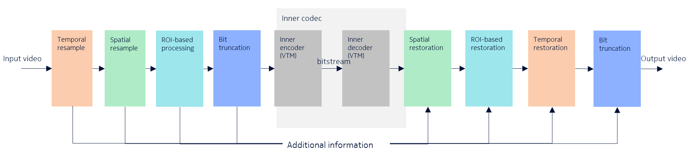

# introduction
VCM common framework, also referred to as VCM reference software (VCMRS) provides a reference implementation of the video coding for machines standard developed within the MPEG. The architecture of the common framework is shown as the following.



# Installation

System requirements

- GPU cards with at least 11G of video memory, for example, Nvidia RTX 3080, Nvidia Tesla V100-  SXM2-16G
- x86 architecture CPU
- 32G of RAM
- 200G of free hard disk space
- Linux distribution, for example, Ubuntu 18.04, 20.04 and 22.04
- CUDA driver version 11.3 or above
- Anaconda or miniconda

For this release, only installation scripts for development purpose are provided. To install the VCMRS package, run
```
bash install.sh
```

Note that the installation script creates a conda virtual environment, named `vcm`, and installs the dependencies in this environment. The `vcm` environment shall be activated before using the VCMRS, for example, 

```
conda activate vcm
```

The pretrained neural network models are stored in the MPEG content FTP server. Credentials for the MPEG content FTP server shall be requested from the responsible person in the MPEG. The installation script asks for the password for the server to download the pretrained models.

# Usage

- To encode an image

```
python -m vcmrs.encoder --quality <QP_value> <image_file_name>
```

- To encode a video whose frames are stored in a directory

```
python -m vcmrs.encoder --directory_as_video --quality <QP_value> <video_directory>
```

- To decode a bitstream,

```
python -m vcmrs.decoder <bitstream_file_name>
```

More information about input arguments can be shown with command

```
python -m vcmrs.encoder --help
python -m vcmrs.decoder --help
```
# Encoding/decoding VCM test dataset

The scripts to encode the VCM test dataset are in in folder `Scripts`. The test data shall be stored in `Data` folder with the following structure. 

The default descriptor files are available on repository within `Descriptors` folder.
In general, proponents should NOT modify the default descriptors.
In a situation when a proponent modifies the encoder structure, such that generation of new descriptors is needed:
1) The new descriptors should be placed in a separate new directory inside "Descriptors", next to “TemporalResampleOFF” and “TemporalResampleRatio4”.
2) The internal structure of folders should be maintained (e.g. structure of Pandaset, TVD, SFU, ROI, SpatialResample folders).
3) The usage of new descriptors should be enforced in "Scripts/utils.py" in get_descriptor_files function.
4) The descriptors should be uploaded on GIT.
5) The software along with descriptors should be shared with a crosschecker.


```
Data
├── FLIR_test 
│   ├── thermal_images
│   │   ├── FLIR_08931.jpg
│   │   ├── FLIR_08932.jpg
│   │   ├── ...
│   │   └── FLIR_09665.png
├── OpenImages 
│   └── validation 
│       ├── 0001eeaf4aed83f9.jpg
│       ├── 0004886b7d043cfd.jpg
│       ├── ...
│       └── ffeac105c9e17568.png
├── SFU
│   ├── ClassA
│   │   └── Traffic_2560x1600_30.yuv
│   ├── ClassB
│   │   ├── BasketballDrive_1920x1080_50.yuv
│   │   ├── BQTerrace_1920x1080_60.yuv
│   │   └── ParkScene_1920x1080_24.yuv
│   ├── ClassC
│   │   ├── BasketballDrill_832x480_50.yuv
│   │   ├── BQMall_832x480_60.yuv
│   │   ├── PartyScene_832x480_50.yuv
│   │   └── RaceHorses_832x480_30.yuv
│   ├── ClassD
│   │   ├── BasketballPass_416x240_50.yuv
│   │   ├── BlowingBubbles_416x240_50.yuv
│   │   ├── BQSquare_416x240_60.yuv
│   │   └── RaceHorses_416x240_30.yuv
│   ├── ClassE
│   │   ├── FourPeople_1280x720_60.yuv
│   │   ├── Johnny_1280x720_60.yuv
│   │   └── KristenAndSara_1280x720_60.yuv
│   └── ClassO
│       ├── Kimono_1920x1080_24.yuv
│       └── Cactus_1920x1080_50.yuv
├── TVD
│   ├── TVD-01.yuv
│   ├── TVD-02.yuv
│   └── TVD-03.yuv
├── Pandaset_YUV
│   ├── 001_1920x1080_10.yuv
│   ├── 002_1920x1080_10.yuv
│   ├── ...
│   └── 158_1920x1080_10.yuv
└── tvd_object_detection_dataset
    ├── 000013.png
    ├── 000014.png
    ├── ...
    └── 000339.png
Descriptors
├── TemporalResampleOFF
│   ├── SFU
│   │   ├── ROI
│   │   │   ├── BasketballDrill_832x480_50.txt
│   │   │   ├── BasketballDrive_1920x1080_50.txt
│   │   │   ├── ...
│   │   │   └── Traffic_2560x1600_30.txt
│   │   └── SpatialResample
│   │       ├── BasketballDrill_832x480_50.csv
│   │       ├── BasketballDrive_1920x1080_50.csv
│   │       ├── ...
│   │       └── Traffic_2560x1600_30.csv
│   └── TVD
│   │   ├── ROI
│   │   │   ├── TVD-01_1.txt
│   │   │   ├── TVD-01_2.txt
│   │   │   ├── ...
│   │   │   └── TVD-03_3.txt
│   │   └── SpatialResample
│   │       ├── TVD-01_1.csv
│   │       ├── TVD-01_2.csv
│   │       ├── ...
│   │       └── TVD-03_3.csv
├── TemporalResampleRatio4
│   ├── Pandaset
│   │   ├── ROI
│   │   │   ├── 001_1920x1080_10.txt
│   │   │   ├── 003_1920x1080_10.txt
│   │   │   ├── ...
│   │   │   └── 158_1920x1080_10.txt
│   │   └── SpatialResample
│   │       ├── 001_1920x1080_10.csv
│   │       ├── 003_1920x1080_10.csv
│   │       ├── ...
│   │       └── 158_1920x1080_10.csv
│   ├── SFU
│   │   ├── ROI
│   │   │   ├── BasketballDrill_832x480_50.txt
│   │   │   ├── BasketballDrive_1920x1080_50.txt
│   │   │   ├── ...
│   │   │   └── Traffic_2560x1600_30.txt
│   │   └── SpatialResample
│   │       ├── BasketballDrill_832x480_50.csv
│   │       ├── BasketballDrive_1920x1080_50.csv
│   │       ├── ...
│   │       └── Traffic_2560x1600_30.csv
│   └── TVD
│       ├── ROI
│       │   ├── TVD-01_1.txt
│       │   ├── TVD-01_2.txt
│       │   ├── ...
│       │   └── TVD-03_3.txt
│       └── SpatialResample
│           ├── TVD-01_1.csv
│           ├── TVD-01_2.csv
│           ├── ...
│           └── TVD-03_3.csv
└── Other descriptor variants...
```

The configuration of used GPUs, number of workers, output directories shall be performed within the scripts. 

# Development

The scripts for debugging and testing the VCMRS  are available in the [Test folder](Test/)

To develop technologies for pre- and post-inner codec components, and neural network-based intra frame codec, the interfaces are defined in [interfaces.md](Docs/Interfaces.md). Examples are also provided for these components. 

- To use a specific plugin as a pre-inner codec component for encoding

```
python -m vcmrs.encoder --SpatialResample AdaptiveDownsample --quality 42 <file_name> 
```
Note that the pre-inner codec component ID is not transferred in the bitstream. To decode the the bitstream correctly, the bitstream must be decoded using the corresponding post-inner codec component ID as shown in the next item. 

- To use a specific plugin as a post-inner codec component for decoding 

```
python -m vcmrs.decoder --SpatialResample AdaptiveDownsample <bitstream_file_name> 
```


- To use a specific neural network-based intra frame codec 

```
python -m vcmrs.encoder --IntraCodec 'ExampleIntraCodec' <file_name> 

```

- To use VTM as the inner codec, in encoding

```
python -m vcmrs.encoder --InnerCodec VTM <file_name> 

```

Note that, the ID of the inner codec is not tranferred in the bitstream. The data that are encoded using VTM as inner codec shall be decoded with command

```
python -m vcmrs.decoder --InnerCodec VTM <bitstream_file_name>
```

- The position of Inter Machine Adapter

By default, the Inter Machine Adapter (IMA) is in the inner codec. If a test requires the IMA to be applied after other post-inner codec component, input argument `--InterMachineAdapter 0` and `--PostFilter IMA` can be used. For example, the following commands apply AdaptiveDownsampler component before the IMA for encoding and decoding. 

```
python -m vcmrs.encoder --InterMachineAdapter 0 --PostFilter IMA --SpatialResample AdaptiveDownsample --quality 32 <file_name>
python -m vcmrs.decoder --PostFilter IMA --SpatialResample AdaptiveDownsample <bitstream_file_name>
```

### Git repository usage

  - Do not include large binary data in a commit, for example, pretrained neural network models, large image and video data. Large binary data may be stored in MPEG content FTP server and installed using installation script. 
  - Use detailed description in a commit
  - Use issues to report bug, request feature, or initiate a discussion 

### Contributions

Bug fixes and new features must be submitted via merge request. Before submitting a merge request, please set up CI system for your own repository. The instructions for setting up the CI is in `/Docs/CI_setup.md`. To submit a merge request, please follow these guidelines:

- Fork the repository and pull the latest code from the dev branch.

- Create a new branch from the dev branch. Give it a descriptive name that reflects the purpose of your changes.

- Make the changes you want to contribute to the repository. Be sure to write clean code with sufficient comments in the code. If new files are included, please use the correct licence terms, for example, refer to the licence file in the root folder. If a new licence is used, the new licence terms shall be compatible with the licence terms for the VCM-RS. 

- Write test code for your changes to ensure they work as intended and don't break any existing functionality. The test code should be placed in the test folder, with the prefix dbg_test1_ for encoding and dbg_test2_ for decoding. Check the reconstructed data from the encoding and decoding process, and also test the PSNR value from the input uncompressed data.

- Test your changes by running Test/run_all_tests.sh. All tests must pass without error. Your changes will not be merged if they don't pass all tests. You may need to fix some test code if necessary.

- Push your changes to the new branch on your forked repository. Wait for CI on your local repository to pass. 

- Submit a merge request from your forked repository to the dev branch, or a specific branch communicated by the soft coordinators, in the VCM-RS repository. Be sure to provide a clear and concise description of your changes, including any relevant information or context.

  - Wait for the software coordinator to review your changes. Please be responsive, and make any necessary changes to according to the comments.

  - If there are any conflicts between your changes and the main repository, resolve them before your changes can be merged.

  - The Continuous Integration (CI) tests must pass before your changes can be merged. If your tests fail, you need to fix the issues and run the tests again.

  - Once your changes have been reviewed and all tests pass, your changes will be merged into the VCM-RS repository by a SW coordinator.

# known issues

- Too many opened files

  If you encounter this problem, please consider increasing the limit of the number of open files in your system. We have not noticed any negative impact of increasing the limit to a larger number, for example, 100000. You can find more information on how to do this at the following webpage: https://askubuntu.com/questions/1182021/too-many-open-files.


# Release information

- Version 0.12
  - m71112 Spatial resampling SW aspects
  - m71341: Interleaved VCM bitstream (m71341).
  - m71302: Nilinear filter for temporal restoration (but not GPU execution aspect)
  - m71303: Temporal resampling normalization update
  - m71579: Retargeting fixes. Items 1-3, 5, 6
  - m71492: Clahe-based luma-enhancement 
  - m71663: Bit-depth shift cleanup
  - m70724: Colorization tool (dynamic mode decision variant as "on")
  - m70725: CE6.12
  - m71446: CE5.1 - backgrond transmission for semantic segmentation task
  - m71433: NNLF SW improvements
  - m71431: CTC: Disable NNLF
  - m70723; Updated QPs
  - m71431: Remove simple spatial resampling stage. Algorithm description diagram update
 
More information about the releases is available in [Releases](Docs/Releases.txt)
